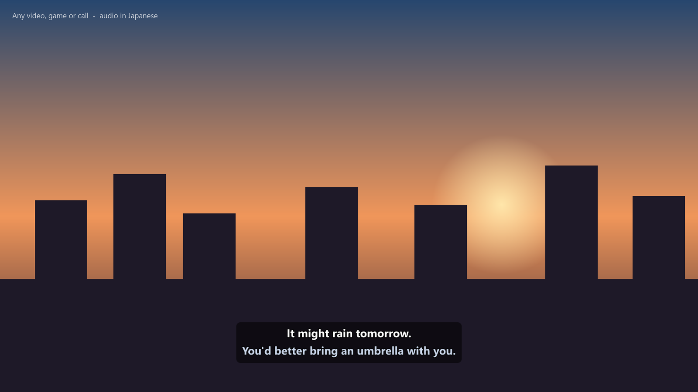
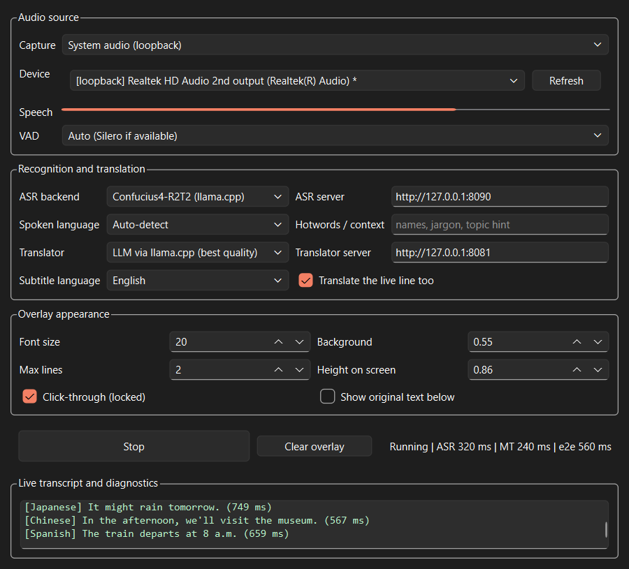

<div align="center">

# 🎬 Realtime Subtitles

**Live, translated subtitles for anything playing on your PC — fully local.**

Speech recognition with [Confucius4-R2T2](https://github.com/netease-youdao/Confucius4-R2T2), translation with a local LLM,<br>
drawn as a click-through overlay on top of any video, game, stream or call.

[](https://github.com/Preygle/realtime-subtitles/actions/workflows/tests.yml)
[](LICENSE)


-AC162C)




</div>

---

## Why this exists

Most live-caption tools either send your audio to the cloud, only work inside
one app, or need an NVIDIA card. This one:

- 🔒 **Runs 100% locally.** No API keys, no accounts, no per-minute billing, nothing leaves your machine.
- 🖥️ **Captions anything.** Captures system audio (WASAPI loopback), so it works on YouTube, Netflix, games, Discord, Zoom, local files — anything with sound.
- 🌏 **30 languages → English.** Auto-detects the spoken language, or you pick one.
- 🟥 **Works on AMD GPUs.** Uses llama.cpp's Vulkan backend: no CUDA, no ROCm, no DirectML. Vulkan also covers NVIDIA and Intel GPUs (untested so far).
- 🪟 **Click-through overlay.** Subtitles float on top of everything and your mouse passes straight through them.
- 📝 **Saves transcripts.** Optionally records every line as `.srt` / `.vtt` subtitles or a timestamped `.txt` transcript — handy for meeting notes or summaries.
- 📜 **Stable text.** Committed lines never rewrite themselves — no flickering, no words changing while you read.
- 🧪 **Measured, not claimed.** Benchmarked against a human transcript of a full hour of real conversation ([below](#-benchmark-1-hour-of-real-japanese-conversation)).

## At a glance

| | |
|---|---|
| **Accuracy** | **89.5%** character accuracy on an hour of unscripted Japanese conversation |
| **Speed** | ASR runs **12× faster than real time**; subtitles typically appear **0.3–1 s** after a sentence ends |
| **VRAM** | ~6 GB for recognition + translation together (fits a 10 GB card with room to spare) |
| **Tested on** | AMD Radeon RX 6700M (10 GB), Windows 11, Python 3.13 |

---

## 🚀 Quick start

**1. Install**

```powershell
git clone https://github.com/Preygle/realtime-subtitles.git
cd realtime-subtitles
pip install -e ".[gui,audio,fast,vad]"
winget install ggml.llamacpp
```

> Already have `onnxruntime-directml`? Leave out `vad`: it works for the VAD
> as-is, and installing both onnxruntime packages breaks them.

**2. Download the models** (~4.8 GB, resumable if your connection drops)

```powershell
powershell -ExecutionPolicy Bypass -File scripts\download_models.ps1
```

**3. Run**

Double-click **`start_subtitles.bat`**, press **Start**, and play anything.

The launcher starts both model servers, waits for them to load onto the GPU,
opens the app, and shuts the servers down again when you close it (freeing
the VRAM for games). Use `start_subtitles.bat keep` to leave them running.

> **Try it before downloading anything:** `python -m rtsubs --asr mock --translate passthrough`
> runs the whole capture → VAD → overlay pipeline with a fake model, so you
> can confirm your audio device works first.

<details>
<summary><b>Screenshot: control panel</b></summary>
<br>

</details>

---

## ⚙️ How it works

```
 system audio ──► Silero VAD ──► segmenter ──► R2T2 ASR ──► LLM translator ──► overlay
 (WASAPI loop-    (is anyone     (cuts at      (llama.cpp    (llama.cpp         (click-through,
  back, 16 kHz)    speaking?)     pauses)       :8090)        :8081)             always on top)
```

Four stages run on separate threads, so a slow model never stalls audio
capture. Between stages, **finished lines are queued and never dropped, but
in-progress lines are "latest wins"** — if the GPU falls behind, only the
newest partial survives, so subtitles track the live audio instead of drifting
further and further behind.

While someone is talking, the current sentence is translated as it grows and
shown as a dimmer **live line**; when they pause it's committed and never
changes again. The overlay keeps at most two lines, rolling the oldest off the
top like TV captions, and each line stays up for as long as it takes to read
(about 15 characters per second, between 2 and 6 seconds).

Languages that put the verb last — Japanese, Korean, Turkish, Hindi — make the
live English reword itself as the sentence completes. If that bothers you, set
**Live line** to *Off* in the control panel: each sentence then appears once,
unchanged, but only after the speaker pauses, so text shows up later.

---

## 🧪 Benchmark: 1 hour of real Japanese conversation

A test on real speech rather than clean read-aloud clips: a full, unscripted
two-person podcast episode, compared against the publisher's own human-written
transcript.

**Test case**

| | |
|---|---|
| Audio | [*1 Hour Real Japanese Conversation #72*](https://www.youtube.com/watch?v=MmvaYPjogwQ) — Okkei Japanese × Japanese with Shun (57:43) |
| Reference | [Official transcript](https://www.okkeijapanese.com/childhood-home-listening-okkei-japanese-72/) — 999 lines, 11,693 characters after normalization |
| Content | Natural conversation between two native speakers: childhood, money, friends, travel, language learning. Overlapping backchannels, laughter, loanwords, names. |
| Pipeline | The app's exact path: Silero VAD → segmenter → Confucius4-R2T2 Q8_0 on llama.cpp (Vulkan) |
| Hardware | AMD Radeon RX 6700M, 10 GB |

### Results

| Metric | Auto-detect language | Language set to Japanese |
|---|---|---|
| **Character accuracy (raw)** | 87.0% (CER 13.0%) | **87.3%** (CER 12.7%) |
| **Character accuracy (reading-normalized)** | 89.2% (CER 10.8%) | **89.5%** (CER 10.5%) |
| Language identified as Japanese | 824 / 883 segments (93.3%) | forced |
| Missed speech (deletion runs ≥ 10 chars) | 2 runs, 49 chars (0.4%) | 2 runs, 49 chars (0.4%) |
| Hallucinated text (insertion runs ≥ 10 chars) | 6 runs, 64 chars (0.5%) | 5 runs, 52 chars (0.4%) |
| ASR speed | — ¹ | **0.082 real-time factor** (≈12× faster than real time) |
| ASR latency per line | — ¹ | **0.32 s mean, 0.62 s p95** |

**Overall score: 8.5 / 10** — see the analysis below for how that breaks down.

¹ *The auto-detect run happened while a second copy of both model servers was
accidentally loaded, which pushed ~6 GB of model weights out of VRAM into
system RAM. Its accuracy is unaffected; its speed numbers were not
representative and are omitted. The forced-Japanese run used a clean GPU.*

### What the two CER numbers mean

Japanese has no spaces between words, so accuracy is measured per character
(**CER** = character error rate; accuracy = 1 − CER). Punctuation and spacing
are removed from both sides first.

The **reading-normalized** score converts both texts to hiragana before
comparing. Japanese can write the same word several ways — 私 / わたし, 子供 /
子ども, 分かる / わかる — and a transcriber's spelling choice isn't a recognition
error. This correction alone accounts for 2.2 points.

### Analysis

**1. Most of the remaining "errors" are style, not misrecognition.**
Over half of all edit operations are *insertions* (781 of 1,480), and the
most-inserted characters are exactly the kana that make up Japanese fillers
and backchannels: あ, う, そ, ん, の, ね (360 of those 781 insertions). The model
transcribes verbatim — "ahh", "yeah", "right, right" — while the published
transcript is an edited, reader-friendly version that leaves them out. If all
of those were fillers, CER would drop by about 3 more points, so the true
misrecognition rate is somewhere around **7.5–10.5%** for spontaneous
conversational speech.

**2. The substitutions that remain are mostly spelling conventions too.**
The top raw substitutions are: digits vs. kanji numerals (2 → 二, 5 → 五,
3 → 三…), kanji vs. kana (子供 → 子ども, 分かる → わかる, 時 → とき), and a speaker's
name written in kanji or katakana where the reference used hiragana. None of
these would confuse a reader.

**3. It almost never loses speech, and almost never makes things up.**
Only 2 stretches of ≥ 10 consecutive characters were missed across the whole
hour, and only 5–6 stretches of ≥ 10 invented characters appeared. The VAD
classified 52.1 of the 57.7 minutes as speech. Hallucination during silence — the classic
failure of Whisper-style models — didn't show up here.

**4. Auto-detect is safe to leave on.**
It labelled 59 of 883 segments as something other than Japanese (29 Cantonese,
15 English, 9 Chinese, 6 other), yet accuracy only dropped 0.3 points. The
misfires cluster on very short backchannels and English loanwords, where
there's little to get wrong. When a misdetected segment did come out as a
Chinese filler character, the translator still rendered it sensibly. If you
know the language, setting it is still marginally better.

**5. Translation: good, limited by fragments.**
There's no English reference for this episode, so 11 evenly spaced lines were
translated and reviewed for meaning: **8 fully correct, 2 weak but defensible, 1
wrong**. All three problems were short fragments — the VAD cuts at natural
pauses, so a line can be half a sentence. The one mistranslation was a long
clause cut mid-phrase whose subject got reassigned. This is a harsher test
than live use: the app passes the previous two lines to the translator as
context, and these samples were translated in isolation.

### Score breakdown

| Area | Score | Why |
|---|---|---|
| Transcription accuracy | 9 / 10 | 89.5% on unscripted two-speaker conversation; most residual error is filler words and spelling style |
| Robustness | 9 / 10 | Negligible missed speech and hallucination over a full hour |
| Speed | 9 / 10 | 12× real time, sub-second per line on a laptop GPU |
| Translation | 7 / 10 | Correct on complete sentences; fragments cut at pauses are the weak spot |
| **Overall** | **8.5 / 10** | |

**Caveats:** one episode, two speakers, studio-quality audio. Noisy game audio,
music-heavy content, or heavy accents will score lower. The translation review
is a small sample, judged without a professional translator.

### Reproduce it

The audio and transcript are copyrighted, so they aren't in this repo. Fetch
them yourself (the scoring script only needs the text of the transcript) and run:

```powershell
pip install rapidfuzz pykakasi
yt-dlp --js-runtimes node -f bestaudio -o bench/okkei72.m4a "https://www.youtube.com/watch?v=MmvaYPjogwQ"
ffmpeg -i bench/okkei72.m4a -ar 16000 -ac 1 bench/okkei72.wav
# save the transcript's dialogue lines as bench/okkei72_ref.txt, then:
python scripts/benchmark.py --audio bench/okkei72.wav --reference bench/okkei72_ref.txt --language Japanese --translate 12
```

`scripts/benchmark.py` works with any recording + reference transcript pair,
in any language.

---

## 🧠 Models

| Role | Model | Download | Runs on |
|---|---|---|---|
| Speech recognition | [Confucius4-R2T2](https://huggingface.co/netease-youdao/Confucius4-R2T2-GGUF) `Q8_0` + audio encoder | 2.5 GB | GPU (Vulkan) |
| Translation | [Qwen3-4B-Instruct-2507](https://huggingface.co/unsloth/Qwen3-4B-Instruct-2507-GGUF) `Q4_K_M` | 2.5 GB | GPU (Vulkan) |
| Voice activity | [Silero VAD](https://github.com/snakers4/silero-vad) v5 | 2 MB | CPU |

**Why R2T2?** It's a streaming speech recognizer built on Qwen3-ASR and trained
to produce *append-only* output: once a word is emitted, it isn't revised.
For subtitles you read while watching, that stability matters more than
anything else. It covers 30 languages and is strongest on Chinese and English.

R2T2 only *transcribes* — it has no translation ability — so a second model
turns its output into English.

### Alternatives built in

| Swap | Command | Trade-off |
|---|---|---|
| **Whisper, single pass** | `python -m rtsubs --asr whispercpp` | Transcribes *and* translates to English in one model (~1.5 GB VRAM), but may rewrite words already on screen. Needs a whisper.cpp server; see [below](#whisper-single-pass-mode). |
| **NLLB-200 on CPU** | `python -m rtsubs --translate nllb` | Frees the translator's VRAM entirely; 200 languages; weaker on idiom and no cross-line context. Run `scripts/convert_nllb.py` first. |
| **No translation** | `python -m rtsubs --translate passthrough` | Subtitles in the original language. |
| **Smaller ASR** | `scripts\run_asr_server.ps1 -Quant Q4_K_M` | 1.3 GB instead of 2.5 GB, slightly less accurate. |

---

## 🎛️ Usage

```powershell
python -m rtsubs                                # GUI (what the .bat launches)
python -m rtsubs --console                      # headless, prints subtitles to the terminal
python -m rtsubs --devices                      # list capture devices
python -m rtsubs --check                        # verify models, servers and VAD
python -m rtsubs --source input                 # caption your microphone instead
python -m rtsubs --language Japanese            # skip auto-detect
python -m rtsubs --target Spanish               # subtitles in another language
python -m rtsubs --wav clip.wav                 # caption a recording
python -m rtsubs --save srt,txt                 # also save subtitles + a transcript
```

- **Ctrl + Shift + S** hides/shows the subtitles without stopping recognition.
- Uncheck **Click-through** in the control panel to drag the subtitles somewhere else.
- **Hotwords / context** takes names or jargon (e.g. a streamer's name, game terms) to improve recognition of them.
- All settings are saved to `config.json`; `config.example.json` lists every option.

### Saving subtitles and transcripts

Turn on **Save transcript** in the control panel (or pass `--save srt,vtt,txt`)
and every finished line is written to `transcripts\` as it happens, one set of
files per session:

| Format | Use it for |
|---|---|
| `.srt` | Subtitles for VLC, MPC, video editors — load it alongside a recording made at the same time |
| `.vtt` | Subtitles for browsers and video platforms |
| `.txt` | A readable transcript with clock times, e.g. `[14:04:05] It might rain tomorrow.`, optionally with the original-language line underneath. Paste it into any AI to summarize a meeting. |

Lines are flushed to disk immediately, so a crash loses at most the sentence
being spoken; sessions with no speech leave no files behind. Saving is off by
default — it records other people's speech, so check that's OK where you are.
Long lines are split to the subtitle standard of two lines of 42 characters.

---

## 🔍 Troubleshooting

<details>
<summary><b>No subtitles appear</b></summary>

Run `python -m rtsubs --check`. Then watch the **Speech** meter in the control
panel while audio plays: if it doesn't move, the wrong capture device is
selected, or the source is very quiet (raise `audio.gain_db` in `config.json`).
</details>

<details>
<summary><b>Subtitles lag further and further behind</b></summary>

The GPU can't keep up. Check nothing else is competing for it — two copies of
the app sharing one pair of servers roughly triples latency, and two copies of
the servers running at once will spill weights into system RAM and slow everything
down roughly 10×. Otherwise use `-Quant Q4_K_M`, raise
`segmenter.partial_interval_ms`, or set the **Live line** to Off (the default).
</details>

<details>
<summary><b>Everything is slower than usual, but nothing else is using the GPU</b></summary>

On laptops the GPU can sit in a low-power state: model requests are short
bursts that keep the GPU only ~20% busy, which isn't enough for the driver to
raise its clocks, so each request runs slowly and the cycle continues. On the
test machine the same request varied between 0.3 s and 1.9 s depending on
power state, with the GPU, CPU and memory otherwise idle. Try switching Windows
to **Best performance** (Settings → System → Power) and your laptop vendor's
tool (MSI Center, Armoury Crate, Legion Vantage…) to its performance profile,
and keep the laptop plugged in.
</details>

<details>
<summary><b>"llama-server not found" right after installing llama.cpp</b></summary>

winget adds llama.cpp to your PATH, but programs that were already running keep
the old one until you sign out. The launch scripts find it anyway via
`scripts/find_llama_server.ps1`; if you run `llama-server` by hand, open a new
terminal first.
</details>

<details>
<summary><b>Port 8090 or 8081 is already in use</b></summary>

Pass `-Port` to `scripts\run_asr_server.ps1` / `run_translator_server.ps1` and
update `asr.base_url` / `translate.base_url` in `config.json` to match.
(8080, llama.cpp's usual default, is avoided because Oracle Database and many
dev servers use it.)
</details>

<details>
<summary><b>Garbage text during silence or music</b></summary>

Make sure Silero VAD is active (`--check` should say `VAD [OK] silero`). The
energy-based fallback VAD can't tell music from speech.
</details>

### Whisper single-pass mode

```powershell
powershell -ExecutionPolicy Bypass -File scripts\download_models.ps1 -WhisperOnly
powershell -ExecutionPolicy Bypass -File scripts\run_whisper_server.ps1
python -m rtsubs --asr whispercpp
```

whisper.cpp publishes no official Windows Vulkan binary: build it with
`cmake -B build -DGGML_VULKAN=ON` (needs the Vulkan SDK and MSVC), or pass
`-WhisperServer C:\path\to\whisper-server.exe`. Don't use a `turbo` model with
translation on — turbo variants were trained without translation data and
translate poorly.

---

## 🧭 How it compares

| | This project | [OBS LocalVocal](https://github.com/royshil/obs-localvocal) | Windows Live Captions | Cloud caption services |
|---|---|---|---|---|
| Captions any app, as an overlay | ✅ | ❌ inside OBS scenes | ✅ | varies |
| Translate 30 languages → English | ✅ | ✅ | ⚠️ Copilot+ PCs only | ✅ |
| Fully offline | ✅ | ✅ | ✅ | ❌ |
| AMD GPU acceleration on Windows | ✅ Vulkan | ✅ Vulkan | n/a | n/a |
| Append-only, non-flickering text | ✅ | ⚠️ partials can change | ❌ revises as it goes | varies |
| Free | ✅ | ✅ | ✅ | usually metered |

---

## 🗺️ Roadmap

- [ ] Native R2T2 streaming (`unfixed_token_num`) for 200–600 ms latency, once a llama.cpp-compatible path exists
- [ ] Per-app audio capture (caption one window while ignoring others)
- [ ] Linux support (PipeWire loopback)
- [ ] Packaged installer

Ideas and PRs are welcome — open an issue first for anything large.

## 🛠️ Development

```powershell
pip install -e ".[gui,audio,fast,vad]" pytest
python -m pytest tests/ -q
```

The test suite runs without models or a GPU (backends are exercised through a
mock and a stub whisper.cpp server). The code is split into `audio/` (capture,
VAD, segmentation), `asr/`, `translate/`, `ui/`, and `pipeline.py`, which wires
them together. New ASR or translation engines only need to implement one small
interface (`asr/base.py`, `translate/base.py`).

## 📄 License and credits

Code: [MIT](LICENSE). Model weights keep their own licenses:
Confucius4-R2T2 — [NetEase Model Use License](https://huggingface.co/netease-youdao/Confucius4-R2T2) ·
Qwen3 — Apache 2.0 · Silero VAD — MIT · Whisper — MIT.

Built on [llama.cpp](https://github.com/ggml-org/llama.cpp),
[Confucius4-R2T2](https://github.com/netease-youdao/Confucius4-R2T2) by NetEase Youdao,
[Qwen3](https://github.com/QwenLM/Qwen3), [Silero VAD](https://github.com/snakers4/silero-vad) and
[PySide6](https://doc.qt.io/qtforpython-6/).
Benchmark audio and transcript © Okkei Japanese / Japanese with Shun, used for evaluation only and not redistributed.

<div align="center">
<br>
<b>If this saved you from squinting at untranslated videos, a ⭐ helps others find it.</b>
</div>
